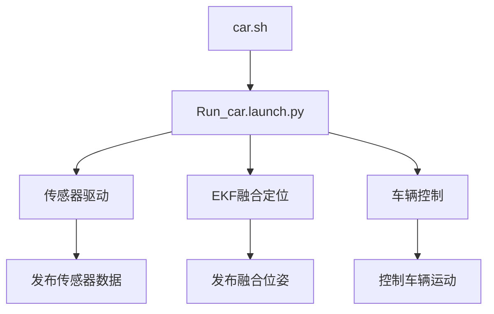
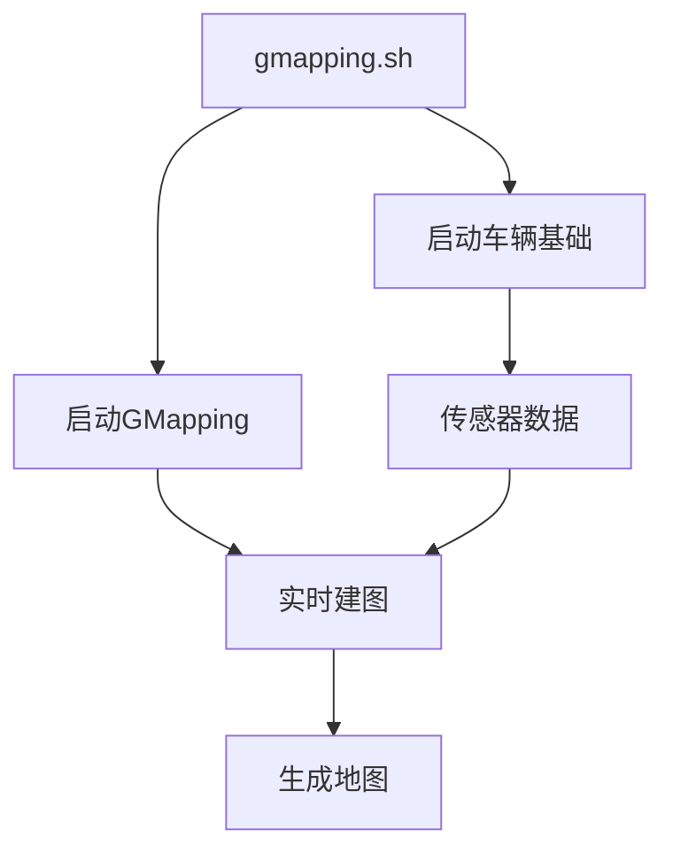
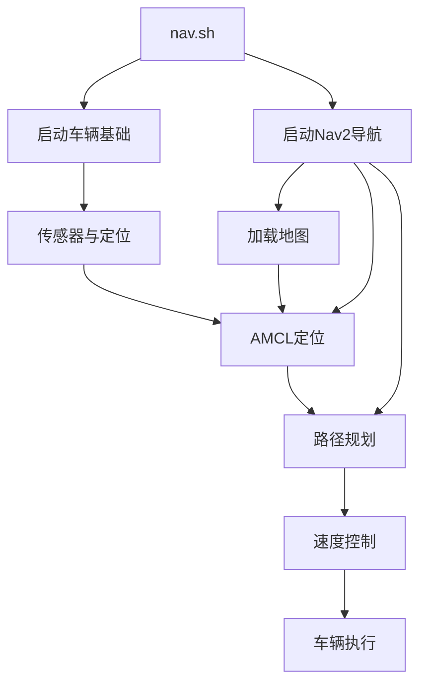
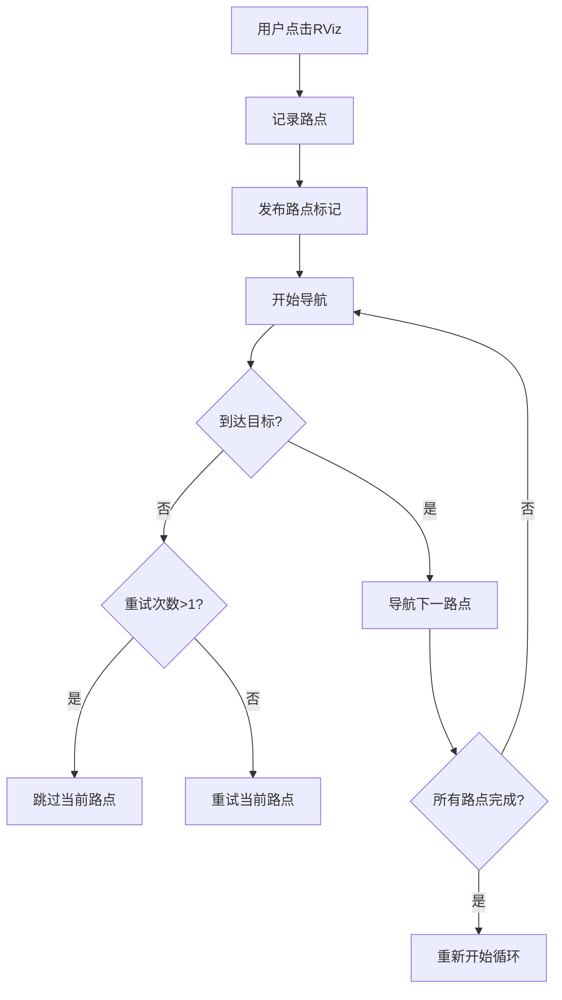

# autonomous-racecara 项目架构与实现分析

## 项目概述

**autonomous-racecara** 是一个基于 ROS2 Humble 的智能驾驶竞速小车软件栈。项目整合了激光雷达(LiDAR)、IMU、编码器等传感器，实现了完整的自动驾驶功能链，包括：

- **SLAM 建图**：使用 GMapping 算法进行实时环境建图
- **自主导航**：基于 AMCL 定位 + Nav2 导航栈的路径规划与执行
- **多点巡航**：支持路点记录与循环导航
- **传感器融合**：激光雷达、IMU、编码器数据融合定位
- **车辆控制**：底层运动控制与遥控功能

## 项目目录结构

### 1. 根目录结构
```
autonomous-racecara-master/
├── README.md              # 项目说明文档
├── go.py                  # 空文件（预留启动脚本）
├── .gitignore            # Git忽略配置
├── racecar/              # 主项目目录（ROS2）
├── navigation/           # ROS1导航栈（参考/备用）
└── catkin_ws/           # ROS1工作空间（历史保留）
```

### 2. racecar/ 核心目录（ROS2实现）
```
racecar/
├── car.sh               # 车辆基础功能启动脚本
├── nav.sh               # 导航系统启动脚本
├── gmapping.sh          # SLAM建图启动脚本
├── nav_one.sh           # 单次导航脚本
├── save.sh              # 地图保存脚本
├── racecar_init.sh      # 初始化脚本
├── build/               # 编译产物
├── install/             # 安装文件
└── src/                 # ROS2包源代码
    ├── encoder/                # 编码器数据节点
    ├── hipnuc_imu/             # IMU驱动与解析
    ├── lslidar_driver/         # 激光雷达驱动
    ├── lslidar_msgs/           # 激光雷达自定义消息
    ├── serial-foxy/            # 串口通信库
    ├── openslam_gmapping/      # GMapping底层算法库
    ├── slam_gmapping/          # GMapping ROS2封装
    ├── nav2_waypoint_cycle/    # 多点巡航（路点循环）
    ├── racecar/                # 应用整合层
    │   ├── config/             # 配置文件
    │   ├── launch/             # Launch文件
    │   ├── map/                # 地图文件
    │   ├── rviz/               # RViz可视化配置
    │   └── src/                # 应用层源代码
    └── racecar_driver/         # 车辆底层控制接口
```

### 3. navigation/ 目录（ROS1参考实现）
包含完整的ROS1导航栈，作为技术参考和备用方案，包括：
- `amcl/` - 自适应蒙特卡洛定位
- `move_base/` - 移动基座导航
- `costmap_2d/` - 代价地图
- `global_planner/` - 全局路径规划
- `dwa_local_planner/` - 动态窗口局部规划

## 关键文件分析

### 1. 启动脚本（Shell脚本）

#### car.sh - 车辆基础功能
```bash
# 启动ROS2 launch文件
ros2 launch racecar Run_car.launch.py
```
功能：启动所有传感器驱动、EKF融合定位、车辆控制节点。

#### nav.sh - 导航系统
```bash
# 1. 启动车辆基础功能
ros2 launch racecar Run_car.launch.py
# 2. 等待10秒后启动导航
ros2 launch racecar Run_nav.launch.py
```
功能：完整导航流程，包含定位、路径规划、控制执行。

#### gmapping.sh - SLAM建图
```bash
# 1. 启动车辆基础功能
ros2 launch racecar Run_car.launch.py
# 2. 启动GMapping SLAM
ros2 launch slam_gmapping slam_gmapping.launch.py
```
功能：实时环境建图。

### 2. Launch文件（Python）

#### Run_car.launch.py - 主启动文件
**功能**：启动所有核心组件
- **EKF融合定位**：`ekf.launch.py`，多传感器数据融合
- **激光雷达驱动**：`lslidar_launch.py`，发布点云/扫描数据
- **IMU驱动**：根据配置类型启动相应驱动
- **编码器节点**：`encoder_node`，发布里程计数据
- **车辆驱动**：`racecar_driver_node`，速度命令转换
- **TF坐标变换**：
  - `base_footprint` → `base_link` (z: 0.15m)
  - `base_footprint` → `laser_link` (x: 0.07m)
  - `base_footprint` → `IMU_link` (x: 0.1653m)

#### Run_nav.launch.py - 导航启动文件
**功能**：启动导航系统
- **多点巡航节点**：`nav2_waypoint_cycle`，路点循环导航
- **Nav2导航栈**：`bringup_launch.py`，完整导航功能

#### bringup_launch.py - Nav2导航栈
**功能**：Nav2框架核心组件
- **定位**：AMCL（自适应蒙特卡洛定位）
- **路径规划**：`planner_server`（全局规划器）
- **行为树导航**：`bt_navigator`（任务执行）
- **配置**：加载地图和参数文件

### 3. 核心功能模块源代码

#### racecar_driver_node.cpp - 车辆控制
**功能**：将ROS速度命令转换为PWM信号
- 订阅话题：`/cmd_vel`（导航速度）、`/teleop_cmd_vel`（遥控速度）
- 速度映射：
  - 线速度：`linear_x = twist->linear.x * 100 + 1500`
  - 角速度：`angle = 1500.0 - twist->angular.z * 1300`
- 串口通信：通过`art_racecar_init()`初始化串口

#### waypoint_cycle.py - 多点巡航
**功能**：记录和循环导航至用户设定的路点
- **路点记录**：订阅`/clicked_point`（RViz点击的点）
- **状态监控**：订阅导航状态`navigate_to_pose/_action/status`
- **循环导航**：按顺序导航至所有记录的路点
- **可视化**：发布`/path_point`话题显示路点标记
- **容错机制**：失败重试和跳过机制

## 系统工作流程

### 1. 数据流架构
```
传感器层 → 数据融合层 → 决策层 → 控制层
    ↓           ↓          ↓        ↓
激光雷达 →   EKF融合  →  Nav2导航 → 车辆驱动
   IMU   →   定位     →  路径规划 → PWM控制
编码器   →  里程计    →  行为树   → 执行器
```

### 2. 运行模式

#### 模式A：基础运行


#### 模式B：SLAM建图


#### 模式C：自主导航


#### 模式D：多点巡航


## 技术特点与实现方法

### 1. 多传感器融合定位
- **EKF（扩展卡尔曼滤波）**：融合激光雷达、IMU、编码器数据
- **配置文件**：`ekf.yaml`、`ekf_carto.yaml`
- **优势**：提高定位精度和鲁棒性，减少单一传感器失效影响

### 2. 模块化软件架构
```
应用层 (racecar/)
├── 配置管理 (config/)
├── 启动管理 (launch/)
├── 可视化 (rviz/)
└── 工具脚本 (scripts/)

中间件层 (ROS2)
├── 通信框架 (Topic/Service/Action)
├── 参数服务器
└── 坐标变换 (TF2)

功能层 (各ROS2包)
├── 感知 (lslidar_driver, hipnuc_imu, encoder)
├── 建图 (slam_gmapping)
├── 导航 (nav2_waypoint_cycle)
└── 控制 (racecar_driver)

硬件抽象层
└── 串口通信 (serial-foxy)
```

### 3. 导航算法栈
- **全局规划**：Nav2的全局规划器
- **局部规划**：DWA（动态窗口法）或TEB（时间弹性带）
- **定位算法**：AMCL（粒子滤波）
- **代价地图**：多层代价地图（静态层、障碍层、膨胀层）

### 4. 可视化与调试
- **RViz预设**：提供多个配置文件
  - `navigation.rviz`：导航可视化
  - `slam.rviz`：建图可视化
  - `odom.rviz`：里程计可视化
- **话题监控**：标准ROS2工具（`rqt_graph`, `ros2 topic`）

### 5. 易用性设计
- **一键脚本**：简化复杂启动流程
- **参数配置**：YAML文件集中管理
- **错误处理**：完善的异常处理和日志记录
- **文档说明**：详细的README和代码注释

## 项目依赖与环境

### 1. 系统要求
- **操作系统**：Ubuntu 22.04
- **ROS版本**：ROS 2 Humble
- **构建工具**：colcon, CMake
- **Python版本**：Python 3.10+

### 2. 主要依赖包
```bash
# ROS2核心
ros-humble-desktop
ros-humble-navigation2
ros-humble-nav2-bringup

# 工具与工具
ros-humble-tf2-tools
ros-humble-rviz2
ros-humble-pointcloud-to-laserscan

# 开发工具
python3-colcon-common-extensions
build-essential
cmake
```

### 3. 硬件接口
- **激光雷达**：LSLidar系列（UDP协议）
- **IMU**：hipnuc系列（串口协议）
- **编码器**：AB相编码器（GPIO或计数器）
- **车辆控制**：PWM信号（串口转PWM模块）

## 扩展与定制建议

### 1. 算法改进
- **SLAM算法**：可替换为Cartographer或LOAM
- **路径规划**：集成更多规划器（A*、RRT等）
- **控制算法**：实现PID控制或模型预测控制

### 2. 功能扩展
- **目标检测**：集成YOLO等视觉算法
- **交通灯识别**：OpenCV颜色识别
- **多车协同**：基于ROS2的多机通信

### 3. 性能优化
- **实时性**：使用实时Linux内核
- **资源管理**：优化节点CPU/内存使用
- **通信效率**：使用零拷贝或共享内存

## 总结

autonomous-racecara项目展示了一个完整的自动驾驶小车软件栈实现，具有以下特点：

1. **完整性**：从传感器到执行器的完整闭环
2. **模块化**：清晰的层次结构和接口定义
3. **可扩展性**：基于ROS2的插件化架构
4. **实用性**：提供一键脚本和详细配置
5. **教育价值**：适合学习和研究自动驾驶技术

该项目不仅实现了基本的自动驾驶功能，还提供了良好的软件工程实践，是学习和开发ROS2自动驾驶系统的优秀参考。

---
*文档生成时间：2026年3月18日*
*基于项目目录：d:\个人\autonomous-racecara-master\autonomous-racecara-master*
